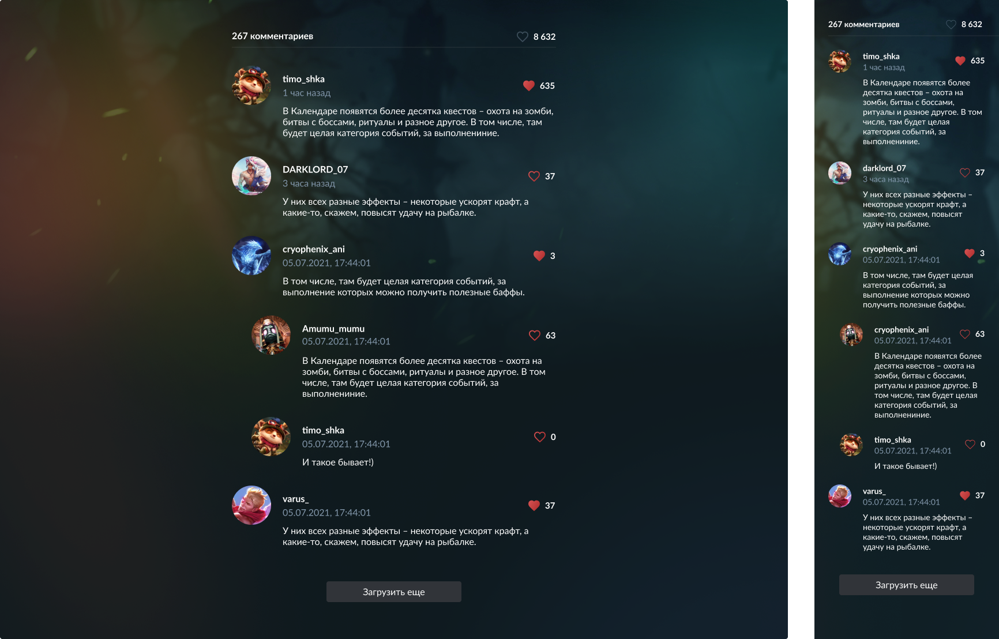

# Тестовое задание
## Примечания к выполненному заданию:

1. Возможность лайкать комментарии добавлена только во время активной сессии и без отправки на сервер, так как отсутствует api для изменения данных и по условию нельзя менять содержимое папки `src/api`
2. Сумма лайков и комментариев считается по мере загрузки страниц, так как информация о полном количестве лайков и комментариев отсутствует во входящих данных. Либо нужно загружать все данные сразу, не используя пагинацию.

## Задачи:

1. Вывести на экран комментарии, соблюдая их вложенность и пагинацию, используя запросы из `src/api`
2. Посчитать сумму лайков и комментариев
3. Добавить возможность лайкать комментарии

## Нельзя:

1. Модифицировать папку `src/api`
2. Менять содержимое возвращаемых данных в `src/data`
3. Модифицировать файл `src/index.tsx`

Что не запрещено - то разрешено

## Дизайн:

### Figma [Comments.fig](Comments.fig)

